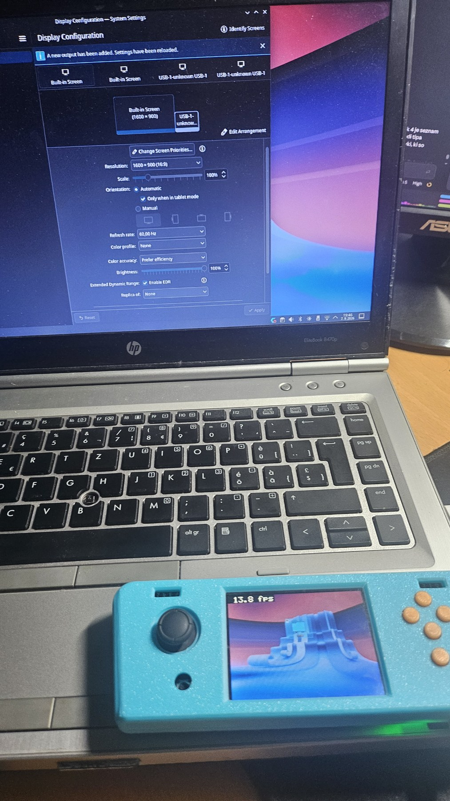

# MiSKo3 as a USB display and gamepad

Firmware that makes an STM32G474 development board appear to Linux as a **real
monitor** and a **HID gamepad** at the same time, over a single USB cable.

No host software. The display is driven by `gud`, which has been in the Linux
kernel since 5.13, and the gamepad by the standard `usbhid`. Plug it in and KDE
offers it as a second screen you can drag a window onto.



*Left: the display settings, where a new `USB-1` output has appeared. Right: the
board showing the desktop. The frame counter on the panel is from a development
build and is not in the published firmware.*

---

## The two numbers that shaped everything

Both were measured before any architecture was chosen.

**A frame does not fit in RAM.** 320 × 240 in RGB565 needs 153,600 bytes. The
STM32G474QET6 has 131,072 bytes in total. A framebuffer is not possible, even
with the memory otherwise empty, so the image has to stream through the device
in bands.

**The cable is slower than the panel.** USB bulk measured 0.768 MB/s; the FMC
parallel bus to the panel measured 48.56 MB/s. A ratio of 63 : 1. With no
compression the panel was busy 1.6 % of the time and USB 98.4 %, so making the
device draw faster achieves nothing. Only sending fewer bytes helps.

## How it works

```
KWin damage rect  ->  kernel splits into bands, LZ4-compresses each
                  ->  SET_BUFFER on EP0, then the bytes on bulk EP1
                  ->  in-place LZ4 decode
                  ->  column-ordered write over the FMC  ->  ILI9341
```

The device presents one USB address with two interfaces: interface 0 is class
`0xFF` with a bulk OUT endpoint for pixels, interface 1 is class `0x03` (HID)
with an interrupt IN endpoint for the buttons and stick.

Four decisions carry the design:

- **Banded transfer.** The descriptor declares `max_buffer_size = 76,800`,
  which is 120 lines, exactly half a frame. The kernel splits every damage
  rectangle by that number, so there is no splitting code on the device.

- **LZ4.** Enabled by one bit in the display descriptor. The host compresses;
  the device only decompresses. The decoder is written from the format
  specification and bounds-checks every input read and every output write,
  because the data arrives over a wire and the part has no MMU.

- **In-place decompression.** Two separate buffers would need 153,600 bytes and
  do not fit. The compressed block is received flush against the far end of the
  output buffer and decoded forwards into its front. This works because every
  LZ4 sequence produces at least as many bytes as it consumes: a match is at
  least four bytes and is written in three. It bought bands twice as large for
  *less* RAM than the two-buffer version used.

- **Column-ordered writes.** `GET_SCANLINE` reports a counter that reaches 323
  while the image is only 240 tall, which means it counts the 320 direction:
  after the `MADCTL` rotation the panel refreshes **column by column**, not top
  to bottom. Writing row-major therefore crosses the whole scan range and no
  starting moment avoids tearing. Writing one column at a time, in the scan's
  own direction, does: a column takes 5.4 µs against the beam's 38.1 µs, so it
  never catches up, and nothing has to wait.

## Results

Measured on hardware with the Cortex-M4 cycle counter. Counters accumulate in
RAM and are printed once a second with the debug bus idle, so the reporting
does not distort what is being measured. Same content throughout: scrolling
text in a terminal.

| | frames/s | ratio | on the wire | pixels delivered | CPU |
|---|---:|---:|---:|---:|---:|
| uncompressed | 5.00 | 1.0× | 768 kB/s | 768 kB/s | 2 % |
| LZ4, 64-line bands | 29.00 | 20.7× | 215 kB/s | 4,454 kB/s | 24 % |
| **in-place, 120-line bands** | **40.00** | **37.9×** | **159 kB/s** | **6,144 kB/s** | 36 % |

Eight times faster while pushing **less** data down the cable than at the start.
Zero decompression errors across the whole test session.

By content, at the final version:

| content | ratio | frames/s |
|---|---:|---:|
| black screen | 238.5× | 5.0 |
| terminal, scrolling text | 37.9× | 40.0 |
| cmatrix | 3.2× | 13.0 |
| photograph | 2.1× | 5.0 |

Two limits remain, both understood rather than outstanding. A horizontal seam
sits at y = 120 because the two bands arrive about 25 ms apart while the panel
refreshes every 12.4 ms. And photographic content does not compress, so it
stays at 5 fps, which is the ceiling of full-speed USB rather than a defect.

Per-milestone measurements are in [docs/milestones/](docs/milestones/), and the
feasibility study that preceded the work is in [docs/FINDINGS.md](docs/FINDINGS.md).

## Requires Linux to work

The display half needs the kernel's `gud` driver, which exists only on Linux.
On Windows the board still enumerates and the **gamepad works**, but interface 0
stays unclaimed and no screen appears. Driving the display from Windows would
mean writing a host-side program that speaks the same protocol over WinUSB, or
an Indirect Display Driver. Neither is in this repository.

Building and flashing, on the other hand, work on Linux, macOS and Windows.

## Build it yourself

### 1. Get the toolchain

**Linux**

```sh
sudo pacman -S arm-none-eabi-gcc arm-none-eabi-newlib make   # Arch, CachyOS
sudo apt install gcc-arm-none-eabi make                      # Debian, Ubuntu
```

**macOS**

```sh
brew install --cask gcc-arm-embedded
```

**Windows**

Install [STM32CubeIDE](https://www.st.com/en/development-tools/stm32cubeide.html).
It brings `arm-none-eabi-gcc`, `make` and STM32CubeProgrammer in one installer.
Build from its own **Build** button, or from a terminal after adding its
`plugins\com.st.stm32cube.ide.mcu.externaltools.*\tools\bin` directories to
`PATH`.

Alternatively install the [Arm GNU toolchain](https://developer.arm.com/downloads/-/arm-gnu-toolchain-downloads)
and [CMake](https://cmake.org/download/) separately, and use the CMake build
below, which does not depend on a Unix shell.

### 2. Clone and build

```sh
git clone --recurse-submodules https://github.com/MrCloudy2/misko3-gud-display
cd misko3-gud-display/firmware
make
```

If you already cloned without `--recurse-submodules`:

```sh
git submodule update --init --depth 1
```

The CMake build is equivalent and is the better choice on Windows, since it
needs no Unix shell:

```sh
cmake -B build -DCMAKE_TOOLCHAIN_FILE=arm-toolchain.cmake -DCMAKE_BUILD_TYPE=Release
cmake --build build
```

Either way you get `build/misko3.elf`, `.hex` and `.bin`, and the same figures:

```
RAM:    84472 B    128 KB    64.45 %
FLASH:  24300 B    512 KB     4.63 %
```

Both builds use identical flags, so the binaries match.

### 3. Opening it in STM32CubeIDE

See [firmware/CUBEIDE.md](firmware/CUBEIDE.md). In short: `File` &rarr;
`New` &rarr; `Makefile Project with Existing Code`, point it at `firmware/`,
toolchain **MCU ARM GCC**.

## Flash

**Linux and macOS**

```sh
./firmware/flash.sh
```

**Windows**

```powershell
powershell -ExecutionPolicy Bypass -File .\firmware\flash.ps1
```

Both scripts find whichever programmer is installed (STM32CubeProgrammer,
`st-flash`, OpenOCD, or probe-rs on Linux), pick the file that tool wants, and
then wait for the board to enumerate and report what appeared. Nothing is
compiled, so a machine that only flashes needs no ARM toolchain: copy
`firmware/build/` across and run the script.

The simplest route on any OS is to open `build/misko3.hex` in the
STM32CubeProgrammer GUI and press Download. A `.hex` carries its own addresses;
if you use the `.bin` instead you must enter `0x08000000` by hand.

Every path caps SWD at 1000 kHz. This is not incidental: about twenty FMC bus
pins switch right beside SWDIO, and at full speed debug transfers are corrupted.

Note that `probe-rs reset` leaves this board unable to complete USB bring-up.
The scripts use probe-rs last and warn when they do. Every other tool resets
cleanly.

`flash.sh` is tested on Linux with all three of CubeProgrammer, `st-flash` and
OpenOCD. `flash.ps1` is a translation of it and has not been run on Windows.

## Layout

```
firmware/          the firmware, and the only code that runs on the board
  src/             ~1,800 lines of C
  Makefile         plain make, for STM32CubeIDE or the shell
  CMakeLists.txt   the same build under CMake
  flash.sh         programmer-agnostic flashing
docs/
  milestones/      measurements from each development stage
  FINDINGS.md      feasibility study, with the numbers that justified the design
  report-sl.pdf    the two-page report submitted at university (Slovenian)
tools/             host-side verification of the LZ4 decoder
tinyusb/           submodule, pinned to the commit this was built against
```

## Attribution

Everything under `firmware/src/` is my own work apart from the ST startup file.

Two libraries are used:

- **[TinyUSB](https://github.com/hathach/tinyusb)** (MIT) provides the USB
  stack, enumeration and the HID class. The GUD interface has no class driver
  in the library; that one is `firmware/src/gud_usbd.c`, registered through
  `usbd_app_driver_get_cb()`.
- **CMSIS** (ST) for register definitions, the startup file and the linker
  script. No HAL or LL functions; registers are written directly.

Other sources that are not code:

- The ILI9341 initialisation sequence follows the board's factory firmware.
- The GUD protocol is defined by `include/drm/gud.h` in the Linux kernel.
  [gud-pico](https://github.com/notro/gud-pico) was read as a reference for
  understanding the protocol; no code was taken from it.
- The LZ4 decoder was written from the published format specification rather
  than adapted from the reference implementation. It is verified by the
  harness in `tools/`: 20,000 valid blocks byte-exact, and 40,000 corrupted or
  truncated blocks with no buffer overrun, under AddressSanitizer.

The board itself is [MiSKo3](https://github.com/mjankovec/MiSKo3), designed at the
Faculty of Electrical Engineering, University of Ljubljana. Its schematics and
factory firmware are not reproduced here.

## Licence

MIT, see [LICENSE](LICENSE).
